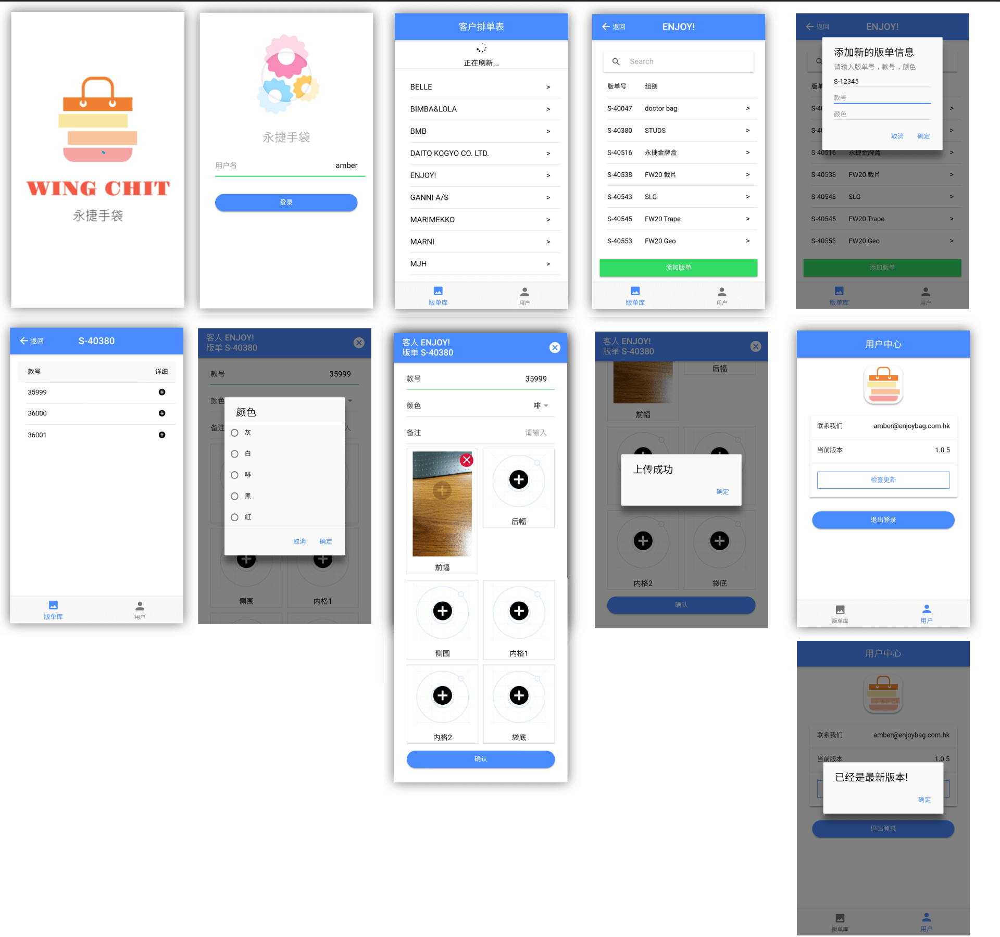

# WingChit App

## Key Features
- Help factory staff to take photos and upload them to sample order system in real-time.
- Only available for Android.

## App Screenshots
  

## App Update Logs

##### 20181009

- Input worker name for record.
- Display 客户排单表, staff can choose the specific client name, sample order id and collection id.
- Select the color and input notes, take photos of 前幅，后幅，two 侧围，内格 and 其他, and 6 pics mostly.
- Check uploaded photos on sample order photo library system, please note that the system will take 10-30 minutes to process and staff can view these photos on Sample Order system the following day.

##### 20181016

- Client list only display ongoing sample orders.
- Staff can input custom sample order id, collection id, and the color to upload photos

##### 20181210

- Only need input username at first time.

- In order to uploading new photos to some completed samples (don't exist on client or sample list), create a new button to add new 版单号, 款号 and 颜色.
- Changed photo list to 前幅, 后幅, 侧围, 内格 1, 内格 2, 袋底.
- Android can update new version app locally.

##### 20181227

- Validate user input a specific sampleId and typeId
- When the app starts, check app version and automatically update it if the server has new newer version.

##### 20190319

- Pull down 客户排单表 and refresh local data.
- Display not only the ongoing sample orders, and also the previous day's completed orders.

### Bug History

- Program execution error, backend data exception ( 款号 S-38046#34504 )

